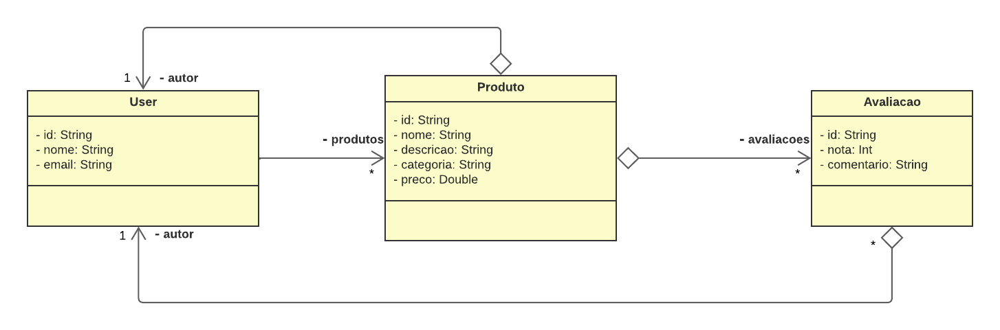
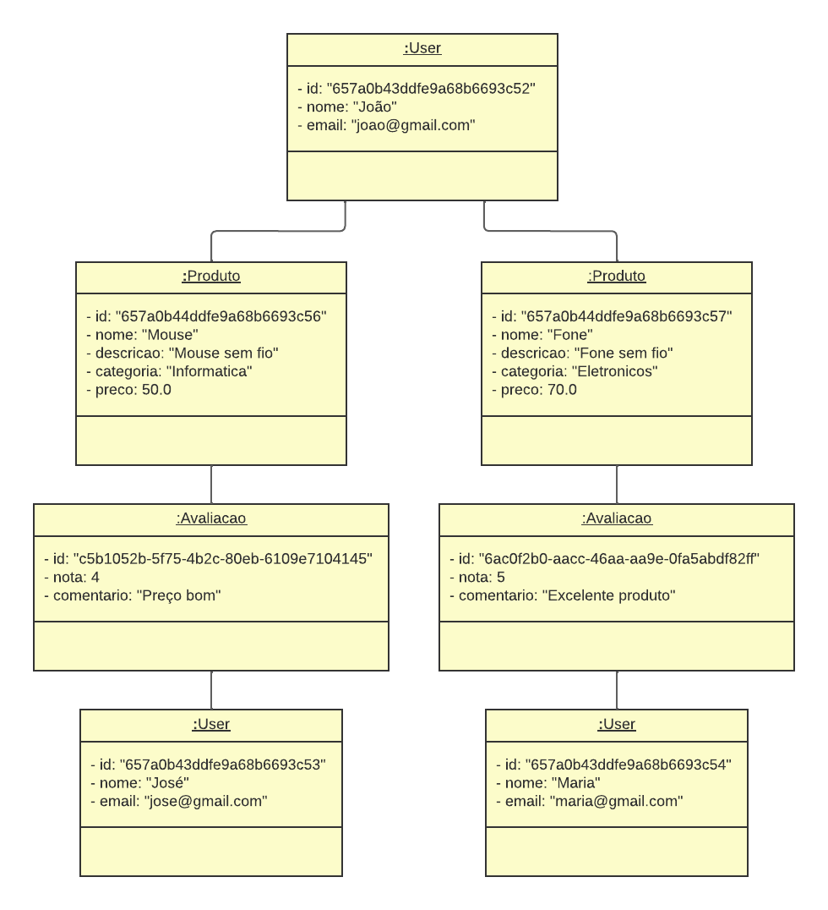
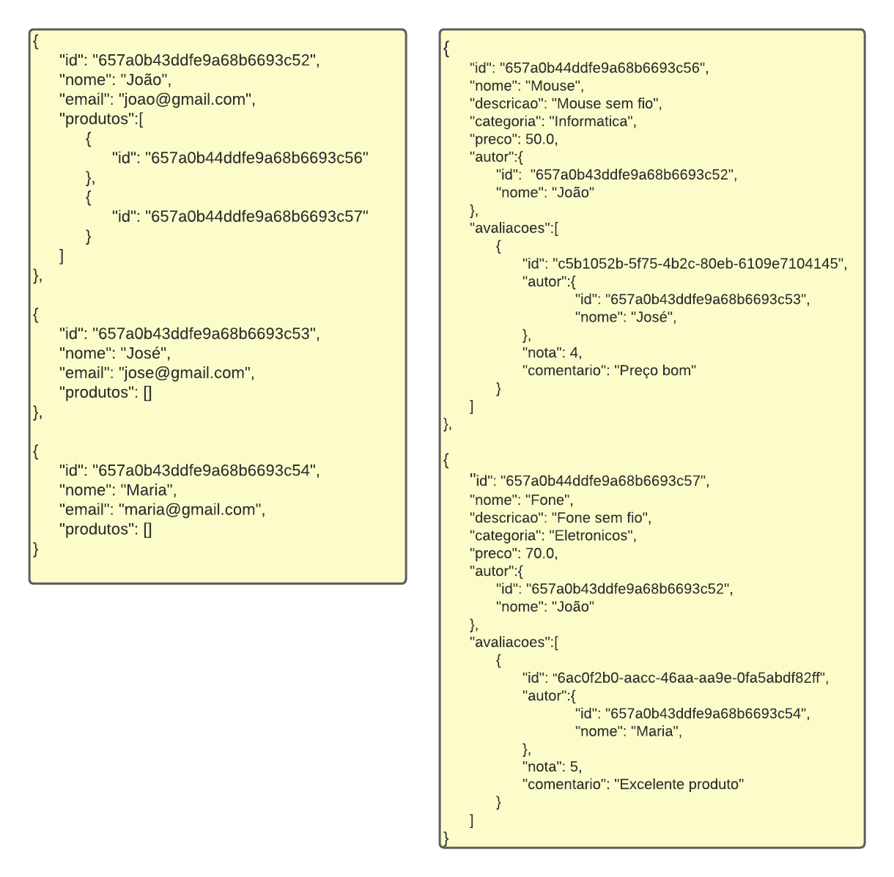

# ApiOpinaProduto-MongoDB

  Este projeto é um Catálogo de Produtos desenvolvido com **SpringBoot** e **MongoDB**, cujo objetivo principal é consistir um CRUD para as entidades em um serviço REST utilizando um banco de dados NoSQL

  Desenvolvido como atividade para a matéria Banco de Dados II do curso Tecnologia em Sistemas para Internet do IFPB - Campus Guarabira

  Grupo:
  - [Alysson Pereira](github.com/AlyssonP)
  - [Wedson Silva](github.com/wedson97)
  - [Yagor Kalenieves](github.com/klnyagor)

## Requisitos
* Java JDK 17 ou superior
* Maven
* MongoDB

### Criando um projeto SpringBoot
* Opcional: 
  > [spring initializr](https://start.spring.io/)

### Instalando o MongoDB
> https://www.mongodb.com/try/download/community <br />
> https://www.mongodb.com/docs/manual/tutorial/install-mongodb-on-windows/

### Configuração do Banco de Dados

>  ```#application.properties``` <br />
>  ```spring.data.mongodb.uri=mongodb://localhost:{port}/{nomedobanco}```

## Entidades







## API Endpoints:

### Rotas de Usuarios:
- Listar Usuários: 
  - ```Get /users```
- Buscar Usuário por id: 
  - ```Get /users/{id}```
- Buscar Produtos do usuario pelo user_id: 
  - ```Get /users/{id}/produtos```
- Buscar Produtos do usuario pelo user_id, por objeto: 
  - ```Get /users/{id}/produtos/por_obj```
- Cadastro de Usuário: 
  - ```Post /users```
- Atualizando dados de Usuário: 
  - ```Put /users/{id}```
- Deletar Usuário: 
  - ```Delete /users{id}```

### Rotas dos produtos:
- Listar Produtos: 
  - ```Get /produtos```
- Buscar Produto por id: 
  - ```Get /produtos/{id}```
- Buscar Produto com preço maior que um valor determinado: 
  - ```Get /produtos/precoMaior/{preco}```
- Buscar Produto com preço menor que um valor determinado: 
  - ```Get /produtos/precoMenor/{preco}```
- Buscar Produto por categoria: 
  - ```Get /produtos/produtoCategoria/{categoria}```
- Cadastrar produto: 
  - ```Post /produtos/{idAutor}```
- Atualizando dados do Produto: 
  - ```Put /produtos/{id}```
- Deletar Produto: 
  - ```Delete /produtos/{id}```

### Rotas especificas das Avaliações dos produtos:
- Buscar Avaliações de um determinado Produto: 
  - ```Get /produtos/{id}/avaliacoes```
- Obter média de nota das Avaliações do Produto: 
  - ```Get /produtos/{id}/avaliacoes/media```
- Avaliar um determinado Produto: 
  - ```Post /produtos/{id}/avaliar/{idAutor}```
- Atualizar informações de uma Avaliação: 
  - ```Put /produtos/avaliacoes/{id}```
- Deletar determinada Avaliação: 
  - ```Delete /produtos/avaliacoes/{id}```

